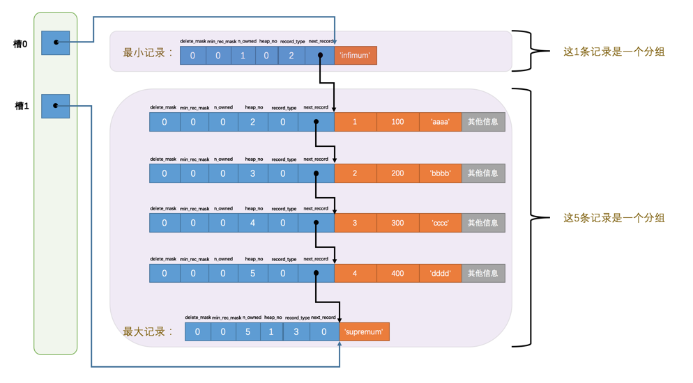
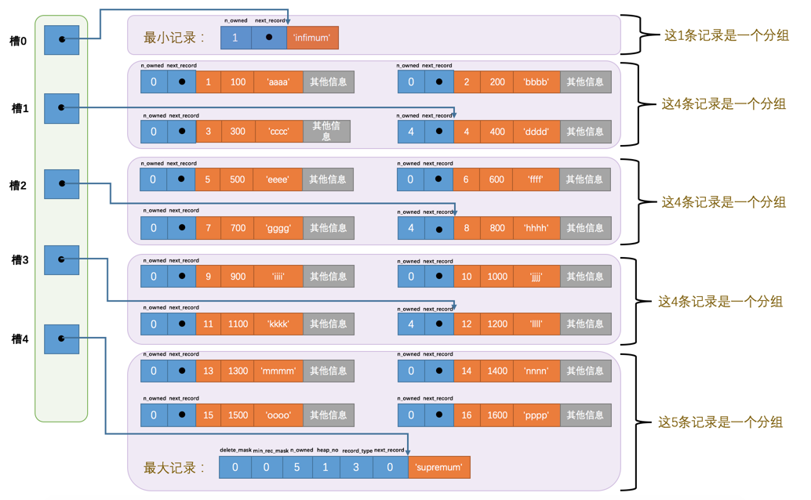

# 重新认识MySQL

连接方式：共享内存、TCP/IP、命名管道、Unix域套接字

客户端处理请求：

- 连接管理（连接池）
- 解析与优化（查询缓存、语法解析、查询优化）-> 生成执行计划
- 存储引擎

显示存储引擎：`SHOW ENGINES;`

```sql
# 创建指定存储引擎的表
CREATE TABLE 表名(
    建表语句;
) ENGINE = 存储引擎名称;

# 修改表的存储引擎
ALTER TABLE 表名 ENGINE = 存储引擎名称;
```

# MySQL的启动选项和系统变量

命令行中使用  `--启动选项1[=值1] --启动选项2[=值2] ... --启动选项n[=值n]`

配置文件中使用

```sql
[server]
(具体的启动选项...)

[mysqld]
(具体的启动选项...)

[mysqld_safe]
(具体的启动选项...)

[client]
(具体的启动选项...)

[mysql]
(具体的启动选项...)

[mysqladmin]
(具体的启动选项...)

```

查看系统变量：`SHOW [GLOBAL|SESSION] VARIABLES [LIKE 匹配的模式];`

系统变量的范围有GLOBAL和SESSION

设置：`SET [GLOBAL|SESSION] 系统变量名 = 值;`

>  默认是查看/设置 SESSION范围的

状态变量：关于程序运行的变量

查看：`SHOW [GLOBAL|SESSION] STATUS [LIKE 匹配的模式];`

# 字符集和比较规则

字符集：字符和二进制的映射规则

比较规则：字符串之间的比较方式

常见字符集：`ASCII`字符集、`GB2312`字符集、`GBK`字符集、`utf8`字符集

MySQL中的字符集：`utf8mb3`、`utf8mb4`

查看当前MySQL支持的字符集：`SHOW (CHARACTER SET|CHARSET) [LIKE 匹配的模式]`

比较规则的查看：`SHOW COLLATION [LIKE 匹配的模式];`

字符集和比较规则的级别：服务器、数据库、表、列	

- 服务器级别：系统变量 `character_set_server`、`collation_server`

- 数据库级别： 系统变量`character_set_database`、`collation_database`

  ```sql
  CREATE DATABASE 数据库名
      [[DEFAULT] CHARACTER SET 字符集名称]
      [[DEFAULT] COLLATE 比较规则名称];
  
  ALTER DATABASE 数据库名
      [[DEFAULT] CHARACTER SET 字符集名称]
      [[DEFAULT] COLLATE 比较规则名称];
  
  ```

- 表级别：

  ```sql
  CREATE TABLE 表名 (列的信息)
      [[DEFAULT] CHARACTER SET 字符集名称]
      [COLLATE 比较规则名称]]
  
  ALTER TABLE 表名
      [[DEFAULT] CHARACTER SET 字符集名称]
      [COLLATE 比较规则名称]
  
  ```

- 列级别：

  ```sql
  CREATE TABLE 表名(
      列名 字符串类型 [CHARACTER SET 字符集名称] [COLLATE 比较规则名称],
      其他列...
  );
  
  ALTER TABLE 表名 MODIFY 列名 字符串类型 [CHARACTER SET 字符集名称] [COLLATE 比较规则名称];
  
  ```

设置服务器和客户端字符集一样：`SET NAMES 字符集名;`

# InnoDB记录结构

InnoDB读取数据是一页页读取的，一般是16KB

行格式：`Compact`、`Redundant`、`Dynamic`和`Compressed`

指定行格式：

```sql
CREATE TABLE 表名 (列的信息) ROW_FORMAT=行格式名称
    
ALTER TABLE 表名 ROW_FORMAT=行格式名称
```

COMPACT行格式：


行溢出：

`varchar`最多能存储多少数据：65535-2（长度）-1（null标识符）

一行中的所有列（不包括隐藏列）最多能存放65535字节

在`Compact`格式中，对于非常大的数据，只会存储一部分，会拿出20字节储存真实数据的地址


`Dynamic`和`Compressed`格式：会将行溢出的数据全部存放到其他位置


`Compressed`会使用压缩算法对页面进行压缩

# InnoDB的数据页结构


记录：

`delete_mask`：标记是否被删除，如果被删除了，会置1，将其加入到垃圾链表中

`min_rec_mask`：是否是非叶子节点的最小记录

`n_owned`：每个分组中最后一条记录，保存该分组的记录个数

`heap_no`：记录记录在本页的位置，从2开始，0和1分别为最小和最大记录的的伪记录

`record_type`：记录类型

`next_record`：下一条记录的偏移量

Page Directory：

Page Header：

储存页面信息，如槽数量、记录数量、Free Space的起始位置等

File Header：

页号、校验和、页类型、本页的上一个和下一个页号（一个页存不下）

File Trailer：

校验和

